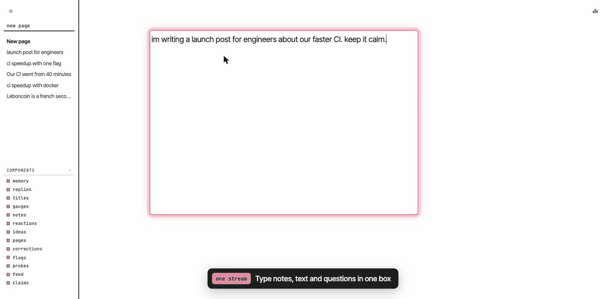
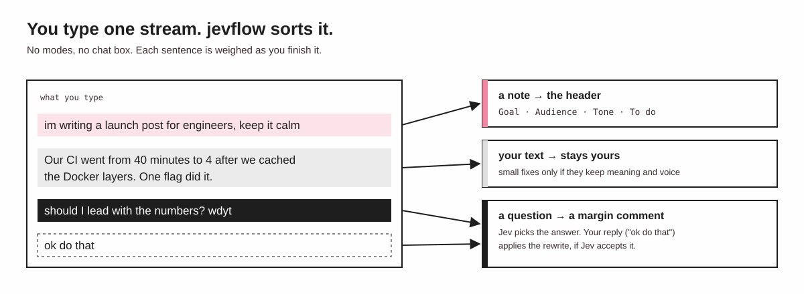
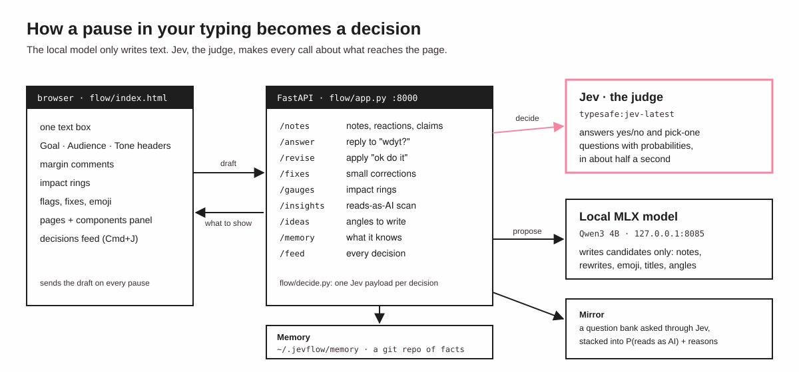
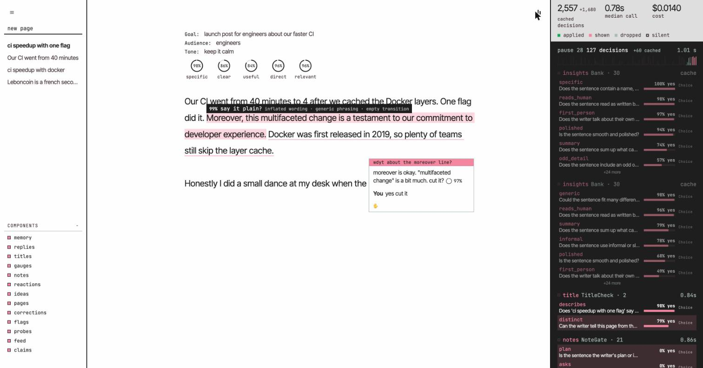

# jevflow

**A writing coworker that sits in your document while you write.**

jevflow reads each sentence as you type it. It knows what you're writing and who it's for, and it stays out of the way until something is worth saying.



<sub>Recorded on a local instance. The model output is unedited; the pink outlines and captions were overlaid in the browser for the recording. The reply's rewrite is refused (✋) because Jev found it failed a check, so the draft stays as typed.</sub>

## One stream, no modes

You type the text, your notes and your questions in one stream, the way you'd think out loud next to a colleague. jevflow sorts them. Notes go to the top of the page, questions get an answer in the margin, and the text stays yours.



## Jev decides, the local model only writes

Every decision is a question to **Jev**, a judge model that answers in about half a second. Is this a note or part of the text? Does this line land? Will readers get the joke? Does this fix keep your meaning? That speed is what lets it keep up with you.

A small local model (Qwen3 on MLX) proposes candidates: a header value, a rewrite, an emoji, a page title. Jev scores them and only what passes its gates reaches the page. No model wording goes straight to your draft unchecked.



Every Jev call shows up live in the decisions column (the bar icon at the top right, or <kbd>Cmd</kbd>+<kbd>J</kbd>), with its questions, probabilities, latency and cost, and what the page did with each: **applied**, **shown**, **dropped** or **silent**.



## What it does

Each part is a component you can turn off from the pages panel (<kbd>≡</kbd>). A component that's off asks Jev nothing.

| Component | What you see |
| --- | --- |
| **notes** | A sentence about the draft ("im writing this for engineers", "make it calmer") lifts into the Goal, Audience, Tone or To do header. |
| **replies** | A question to the coworker ("wdyt?") becomes a margin comment, and Jev picks the answer. Reply "ok do that" and it applies the rewrite, if Jev accepts it. |
| **corrections** | Finished sentences get small fixes, kept only if they preserve your meaning and voice. |
| **gauges** | Rings that score the draft on what matters for your Goal (for a launch post: *specific*, *proof*, *no hype*…). |
| **flags** | Sentences that read as AI-written get a highlight and a question, like "cut the transition?". |
| **claims** | A checkable fact that reads as false gets a ring with P(true) and a one-click fix. |
| **reactions** | An emoji on a line that lands, like a joke or a bold claim. Keyboard mash gets a check-in instead. |
| **memory** | Remembers lasting facts about you and recalls the ones that matter for this draft. |
| **ideas** | Ask for inspiration and get angles that fit your Goal and are specific to you. |
| **probes** | Copy a selection and ask your own yes/no question about it; the answer shows as a ring. |
| **pages** | Keeps your pages and opens a new one when you start writing something else. |
| **titles** | Names each page after what it says, so no two pages look alike in the sidebar. |
| **feed** | Shows every decision live in a column on the right. |

<kbd>Cmd</kbd>+<kbd>Z</kbd>, or typing "undo", reverts the last edit, and a reverted edit is not reapplied.

## Run it

Needs an Apple Silicon Mac (the text model runs locally on MLX) and your own TypeSafe API key for Jev.

```sh
# 1. Install
uv sync

# 2. Set your key in the shell, never in a file in the repo
export TYPESAFE_API_KEY=<your key>

# 3. Start the local text model on port 8085
uv run autocomplete/mlx_server.py --model Qwen/Qwen3-4B-MLX-4bit --port 8085

# 4. In another terminal, start the app
uv run python -m flow.app
```

Open <http://127.0.0.1:8000> and start typing. The page's prompt is the whole manual: *just write. tell me what it's for as you go.*

> [!TIP]
> The same MLX server with `--model Qwen/Qwen3-1.7B-MLX-8bit --port 8083` returns `n` continuations from one batched call.

Memory lives outside the project, in `~/.jevflow/memory`: plain markdown files in a local git repo, one dated fact per line. Every write is a commit, so you can read, edit or roll back what jevflow knows about you.

## Project layout

```
flow/            the writing flow
  app.py         FastAPI server and routes
  index.html     the whole page: editor, margin, rings, feed
  decide.py      note, reply, fix and timing decisions, one Jev payload each
  jev.py         the single Jev agent every module calls through
  generator.py   prompts for the local MLX model (text only, never decisions)
  feed.py        in-memory ring buffer of every Jev call, polled by the page
  gauges.py  claims.py  reactions.py  memory.py  ideas.py  titles.py  components.py
mirror/          the "reads as AI" detector
  questions.py   the yes/no question bank asked about each sentence
  model.py       logistic stacker over Jev's answers (weights in model.json)
  scan.py        scores prose sentence by sentence, with reasons
autocomplete/
  mlx_server.py  OpenAI-compatible MLX server for the local model
text_processing.py  sentence splitting and paragraph grouping
```

Thresholds in each module are calibrated on real sentences, and the docstring next to each one records the scores it was set from. Change them with that evidence in hand.
